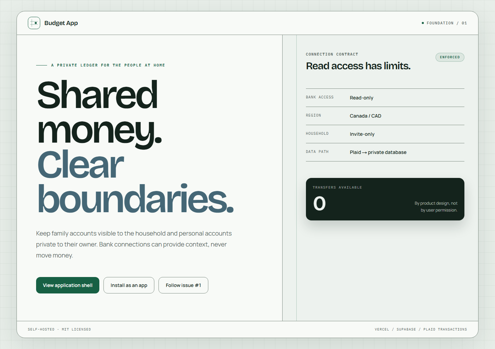
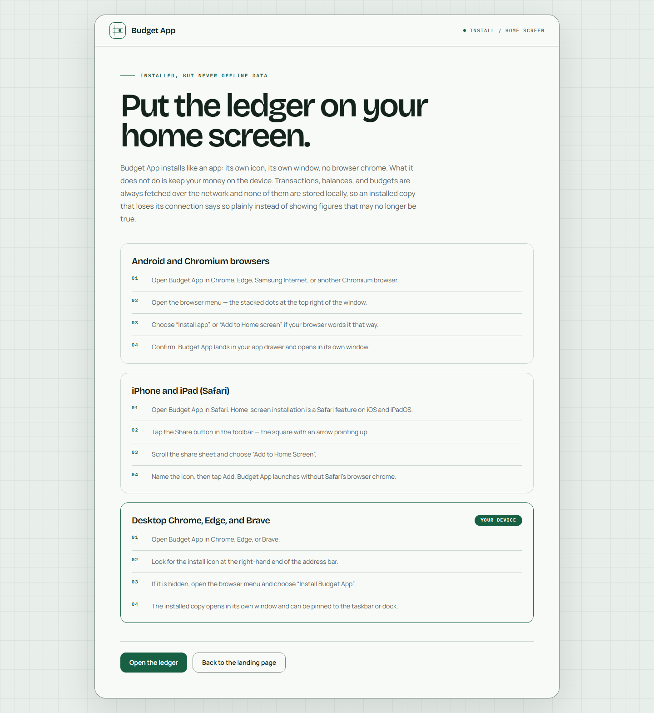
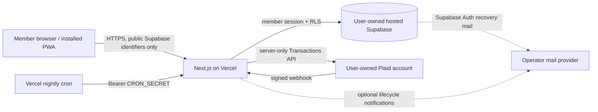

<div align="center">

<picture>
  <source media="(prefers-color-scheme: dark)" srcset="docs/logo-dark.svg">
  
</picture>

# Budget App

**A read-only family budgeting app for Canadian households, operated on infrastructure you control.**

Connect Canadian accounts through your own Plaid account, keep Family and Personal money deliberately separate, and store the household ledger in your own hosted Supabase project.

[](https://github.com/patrickxunuo/budget-app/actions/workflows/ci.yml)
[](./LICENSE)
[](https://nextjs.org/)
[](https://supabase.com/)
[](https://plaid.com/)

</div>

## The product boundary

|                                   | Contract                                                                                                                   |
| --------------------------------- | -------------------------------------------------------------------------------------------------------------------------- |
| **Canada and CAD only**           | Canadian institutions and Canadian-dollar chequing, savings, and credit-card accounts                                      |
| **Read-only**                     | Plaid **Transactions** access only. Budget App cannot initiate transfers, payments, or any financial transaction           |
| **Family / Personal isolation**   | Family data is shared with active household members; Personal data is visible only to its owner. There is no Combined view |
| **Invite-only household**         | The first visitor claims one workspace; all later members join through owner-generated invite links                        |
| **Operator-owned infrastructure** | One household uses its own Vercel, hosted Supabase, and Plaid accounts                                                     |

Normal application access is protected by PostgreSQL row-level security. The Family owner has no normal application path into another member's Personal records. The infrastructure administrator is nevertheless trusted: control of Supabase/service-role access or Vercel secrets permits access to the underlying database or deployed code. Read the [security policy](./SECURITY.md) and [operations trust boundary](./docs/operations.md#ownership-and-privacy-boundary) before inviting a household.

## Screenshots

Both images are real captures of public, data-free routes; they contain no household financial records.

<table>
  <tr>
    <td width="50%"><a href="./docs/screenshots/landing.png"></a></td>
    <td width="50%"><a href="./docs/screenshots/install.png"></a></td>
  </tr>
  <tr>
    <td align="center"><strong>Public landing page</strong></td>
    <td align="center"><strong>Data-free install guidance</strong></td>
  </tr>
</table>

[View the full landing screenshot](./docs/screenshots/landing.png) · [View the full install screenshot](./docs/screenshots/install.png)

## What it does

- Links Canadian institutions through Plaid, then places each eligible account in either Family or Personal scope.
- Imports Transactions data with cursor-based, idempotent webhook/manual/nightly sync.
- Tracks cent-exact CAD income, spending, transfers, refunds, categories, merchant rules, budgets, and manual cash entries.
- Shows separate Family and Personal dashboards, connection freshness, consent and login-repair state.
- Exports the complete filtered visible ledger as spreadsheet-safe CSV.
- Disconnects an Item while either retaining read-only history or permanently deleting its local data; provider access is revoked first.
- Supports installable PWA presentation without caching financial pages or API responses for offline use.

Unsupported accounts remain visible during linking with an explanation; they are not silently imported. Budget App is not multi-currency, not a bank, not a money-movement product, and not a hosted multi-tenant service.

## Architecture



- `src/app/` — public/authenticated App Router pages and API route handlers.
- `src/lib/supabase/` — browser, SSR, and narrow privileged clients; database RLS is the authorization boundary.
- `src/lib/plaid/` — server-only link, sync, webhook, repair, encryption, and disconnect logic.
- `supabase/migrations/` — versioned schema, RLS, RPCs, and invariants; deployed separately from application code.
- `e2e/` and `supabase/tests/database/` — Playwright journeys and pgTAP policy/invariant coverage.

Only `NEXT_PUBLIC_SUPABASE_URL` and `NEXT_PUBLIC_SUPABASE_PUBLISHABLE_KEY` enter browser JavaScript. Service-role, Plaid, encryption, cron, and SMTP values are server-only.

## Supported deployment

Budget App v1 supports **Vercel + a user-owned hosted Supabase project + a user-owned Plaid account**. The repository's local Supabase Docker stack is for development and tests; a bundled or self-hosted Supabase Docker distribution is **not supported for v1**.

Start with the complete [deployment guide](./docs/deployment.md). It covers blank-project migrations, Supabase auth/SMTP, the 30-day application session, Plaid Sandbox and Trial/Production, the mandatory HTTPS `/accounts` OAuth redirect, Vercel secrets/cron, backups, and first-owner setup. Vendor plans and prices change; consult each vendor rather than relying on this repository for pricing or quota guarantees.

> [!IMPORTANT]
> A Vercel deployment ships application code only. Database migrations deploy separately with `pnpm exec supabase db push --linked`.

## Local development

Prerequisites: Node.js 22, Corepack/pnpm 8.14, Docker, and a Plaid Sandbox account.

```bash
git clone https://github.com/patrickxunuo/budget-app.git
cd budget-app
corepack enable
pnpm install --frozen-lockfile
cp .env.example .env.local
pnpm db:start
pnpm db:reset
pnpm dev
```

Fill `.env.local` with the values printed by local Supabase and safe Plaid Sandbox credentials/placeholders. Open <http://localhost:3000>; the first visitor claims the local workspace. OAuth institutions cannot be linked from local HTTP because Plaid requires a registered HTTPS redirect.

Run the quality matrix:

```bash
pnpm format:check
pnpm lint
pnpm typecheck
pnpm test
pnpm test:db
pnpm build
pnpm test:e2e
pnpm smoke:plaid
```

`pnpm smoke:plaid` is Sandbox-only and detects provider contract drift that mocks cannot. Before Trial/Production, complete the manual [production smoke checklist](./docs/production-smoke-checklist.md) using a disposable real Canadian Item.

## Operator and contributor guides

- [Deployment](./docs/deployment.md) — hosted Supabase, Plaid, Vercel, environment variables, cron, SMTP, owner claim, and release verification.
- [Operations](./docs/operations.md) — privacy/trust, backup/restore, invitations, connection repair/disconnect, export/deletion, monitoring, troubleshooting, rollback, and incidents.
- [Production / Trial smoke checklist](./docs/production-smoke-checklist.md) — numbered real-institution release verification.
- [Contributing](./CONTRIBUTING.md) — local setup, actual test commands, pull requests, and release checklist.
- [Security policy](./SECURITY.md) — private reporting, supported versions, response expectations, secret handling, and administrator trust.
- [Environment template](./.env.example) — safe placeholders and public/server-only boundaries for every runtime variable.

## Security reporting

Please do not open a public issue for a vulnerability. Use a [private GitHub Security Advisory](https://github.com/patrickxunuo/budget-app/security/advisories/new) and follow [`SECURITY.md`](./SECURITY.md). Never include real credentials or household data.

## Roadmap and license

See [open issues](https://github.com/patrickxunuo/budget-app/issues) for planned work. Budget App is [MIT licensed](./LICENSE), provided without warranty.

---

<div align="center">
<sub>Budget App cannot move your money. It can only read what your bank already knows.</sub>
</div>
